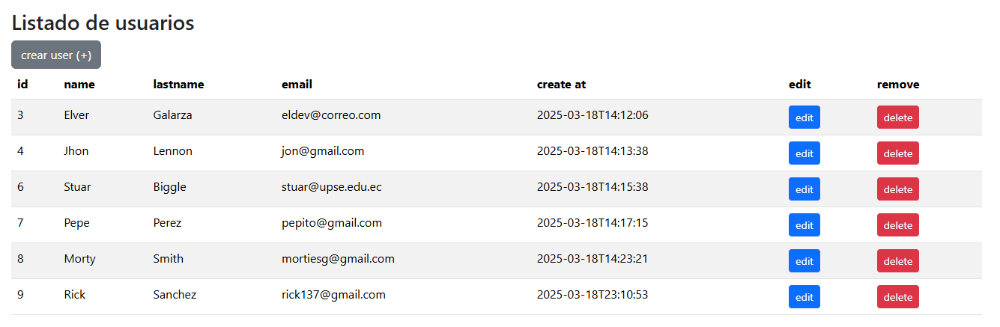

# List of Users with Spring Boot

>[!NOTE] 
> 
>This is my first project learning this wonderful framework.
> 
> Since it is a base project, I will use it to implement additional functionalities or attach it to another project in the future.

This Spring Boot MVC project implements a:
- controller and a view, ***JPA (Entity, Repository, and Service)***.
- It has a list and a form.
- It uses ***MySQL*** as a database.
- It has form validation.
- It uses ***Bootstrap CSS*** for styles and details.

>[!IMPORTANT]
> 
> **Note:** This project is a work in progress, I will be updating it as soon as possible.